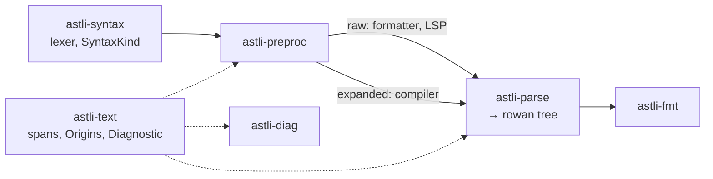

# Project plan

> **Status:** lexer, preprocessor, parser, formatter v0 and the crate APIs
> done (M1–M5). No milestone is open.

## 1. What this is

SystemVerilog language tooling in Rust, built around one lossless syntax tree.
The name is Swiss German *Ästli*, "little branch", which is also an AST, in the
line of Zurich's Zopfli and Brotli. Every library crate is prefixed `astli-`,
`astli` re-exports them all, and the driver is `astli-cli`, whose binary is
`astli`.

Existing options are unsatisfying: `verible-verilog-format`'s output is not
what I want, `slang` is excellent but C++ and not built for formatting, and the
Rust attempts (`sv-parser`, `moore`, `svls`) are slow, abandoned, or not
lossless.

### Objectives, in priority order

1. **A formatter I actually want to use**, correct on `` `ifdef ``-heavy,
   UVM-macro-heavy code and not only on textbook RTL.
2. **A reusable lossless syntax layer** for a linter, an LSP, refactoring.
3. **A standalone preprocessor crate.** The Rust ecosystem has nothing good.
4. *(Speculative)* Semantic analysis: name resolution, elaboration, types.

### Non-goals

- Simulation, synthesis, netlists.
- Replacing `slang` as a compiler.
- Full Annex A coverage before shipping; see [D3](#4-decisions).
- A separate Verilog-95/2001 mode.

`slang` is the reference to consult when a design question has a non-obvious
answer. Understand its choices; don't transliterate them or reuse its type
names.

## 2. Architecture

| Crate | Holds |
| --- | --- |
| `astli-text` | Source ids, spans, the buffer store (`Origins`) and its origin map, `Diagnostic`. No dependencies. |
| `astli-syntax` | `SyntaxKind` (tokens *and* nodes, one enum), the `logos` lexer, keywords, the `rowan` `Language` impl, and `ast`: typed views generated from `astli.ungram`. |
| `astli-preproc` | Directives, the macro table, expansion, includes, conditionals. Both output modes. No grammar. |
| `astli-parse` | The event-based parser, the tree builder, `SyntaxTree`. |
| `astli-diag` | Rendering a diagnostic with its expansion and include chain (`ariadne`). |
| `astli-fmt` | `format`, and the transparency check that guards it. |
| `astli` | The driver: one subcommand per stage (`lex`, `preprocess`, `parse`, `fmt`), filelists, parallelism, rendering. |

What each crate *exposes* is in [`api.md`](api.md). Corpus-wide research tools
(`metrics`, `verbatim-report`, `conditionals`, `unformatted`) stay examples. The rule is that a
per-file dump belongs to the driver and a question about the corpus stays an
example.

**Two token streams, one grammar.** Raw mode keeps directives, macro calls and
every conditional branch as structure and follows no include. The formatter and
the LSP's in-buffer requests read it. Expanded mode expands macros, follows
includes and evaluates conditionals, with per-token provenance. The parser is
generic over the stream and does not know which one it has. There is no tree
builder for expanded mode yet, because nothing consumes one.
[`preprocessor.md`](preprocessor.md) has the design.

**Trivia.** Whitespace and comments are tokens in the tree, placed by the
builder: leading trivia goes to what follows, and a same-line comment stays
with the token before it. The formatter plans its own comment placement on top
of that ([`formatter.md`](formatter.md#design)).

**Diagnostics.** `Diagnostic` lives in `astli-text` so that every producer can
construct one without a new dependency edge. Its `Span` says which expansion
placed the token, so a message about a macro-produced token can point at the
call the user wrote. The expansion chain is derived at render time. The message
is a pre-rendered `String` and the code a `&'static str` newtype, because
`astli-text` cannot see `SyntaxKind`. Each producing crate keeps one
`diagnostics.rs` catalogue. The lexer reports nothing: `LEX_ERROR` tokens in
the tree are the record. Parser diagnostics sit beside the events and are
truncated by rollback, so almost everything a speculative rule could say is
withdrawn; what survives is a run left unclosed at end of file. Only expanded
mode reports undefined macros, since in raw mode they are the normal case.
Rendering uses `ariadne` with `IndexType::Byte`: its default counts characters,
and one multi-byte character puts every later caret on the wrong line.

**Parallelism** is one file per `rayon` task, in the driver ([D13](#4-decisions)).
Output stays in the order files were named, so runs can be diffed. Measured
4.9x on 8+2 cores over 3000 files.

## 3. Formatter model

- **Trivia is placed, never skipped.**
- **Separation is requested, not written.** Rules request a minimum
  separation, resolved when the next token is written. This gives no trailing
  whitespace and indentation without call sites.
- **Whitespace is discarded, its signal kept.** Blank lines become a gap
  width.
- **Line breaking** uses a Wadler-style document IR; **alignment** is a
  post-pass ([D4](#4-decisions)).
- **Preprocessor transparency is an assertion inside `format`**, not only a
  test ([D5](#4-decisions)).

## 4. Decisions

| # | Decision | Why |
| --- | --- | --- |
| D1 | `logos` for lexing, `rowan` for the tree | `rowan` is the Roslyn lossless-tree model. Lexer modes only where one earns itself; `` `define `` bodies turned out to need one rule, not a mode. |
| D2 | Hand-written recursive descent, event-based, with snapshot and rollback | SV is not LL(k): `foo bar;` and `(a)(b)` need lookahead or backtracking. A formatter must give bytes back on a wrong guess, which is undo, which checkpoints cannot do. |
| D3 | **Verbatim fallback from day one** | An unparsed construct becomes a byte-exact, balanced `VERBATIM` node at an item, member or statement boundary, so a useful formatter ships at partial grammar coverage. |
| D4 | Column alignment is a post-pass over emitted lines | lowRISC requires aligned connections and encourages aligned declarations. Runs of same-shaped siblings align. A blank line ends a run and a comment line does not: one annotates a group, the other ends it. A long trailing comment gives up its column first. A row whose other columns would take it past the width splits the run: the rows on either side, and a run of rows that do not fit, align among themselves, so no table has holes. Precedent: gofmt's `tabwriter`. |
| D5 | Formatter is preprocessor-transparent, asserted | [`preprocessor.md`](preprocessor.md#the-transparency-invariant). |
| D6 | Formatter never follows `` `include `` | Each file is formatted alone. |
| D7 | Few knobs: indent, line width (default 100), alignment on/off | Opinionated is cheaper and what people want. |
| D8 | MIT OR Apache-2.0 | Rust norm. |
| D9 | Provenance per token, not per byte, carried by the span | Tokens are emitted, not text, so a macro argument token keeps its own call-site span. No role-swapping flag. A text `-E` mode would need its own path. A buffer seen through an expansion gets its own `SourceId`, so a `Span` keeps the buffer's offsets and needs no second location type. |
| D10 | Line table built eagerly when a buffer is added | One vectorisable pass, 4 bytes per line, far cheaper than lexing. A lexer-callback table would put `astli-text` under the lexer and make `line_col` partial. |
| D11 | Node kinds are hand-authored, not Annex A's productions | 122 of 747 productions are pure aliases and 80 are `*_identifier`; the expression grammar does not survive the trip. Generating from it leaves ~660 kinds nothing builds and kills the formatter's exhaustiveness check. |
| D12 | The crate split runs from the parser end | `logos` derives on `SyntaxKind`, which holds node kinds too, so a lexer-only crate would carry them anyway. |
| D13 | Parallelism is per file, in the driver | Nothing inside a file is worth splitting (the largest lexes in 5 ms). Sessions and `SyntaxNode` are `!Send`, so workers return rendered bytes. |
| D14 | `usage` for the CLI, not `clap` | The same declarations produce completions and docs. Commands stay plain functions, so it is cheap to replace. |
| D15 | Formatter output is a function of the file's bytes | No include path, `+define+` or filelist reaches `fmt`, not even to learn macro arities; otherwise editor and CI disagree. Definitions in the file itself still count. |
| D16 | Typed views are generated from a hand-written tree grammar, `astli.ungram` | It describes the tree, not Annex A, so D11 stands. The generated code is checked in, and a test fails when it is stale. Where two children could be of one type, only position tells them apart, and those accessors are written by hand. The corpus is held to the grammar's node shapes, which catches wrong nesting that a round-trip cannot; that gate reads the grammar, not the views. The views wait for a reader such as a linter or an LSP. The formatter does not use them: a rule must write every token once and in order, so it matches a node's children exhaustively, which proves nothing else is there, where an accessor only finds its child. |
| D17 | Each file is its own compilation unit by default; one unit over all files stays possible | The standard requires both. Separate units need no file order and parse in parallel; one unit is what older flows expect, a defines file listed first. Only expanded mode can tell them apart. |
| D18 | One version for every crate; the bare name is the umbrella | Each crate exposes the types of those below it, so a break low down breaks everything above; lockstep costs an unchanged crate a new number and nothing else. The libraries are the point, so they get `astli`, and the binary lives in `astli-cli`. |

## 5. Milestones

Finish each before starting the next.

- **M0 — Scaffolding.** *Done.* Workspace, `prek` hooks (`fmt`, `typos`,
  `actionlint` at commit; `clippy`, `doc` at push). CI runs those and the
  quick test profile.
- **M1 — Lexer.** *Done.* Gapless round-trip over the corpus plus kind audits
  in `astli-syntax/tests/lexer.rs`; round-trip alone proves nothing about
  kinds.
- **M2 — Preprocessor.** *Done.* Token sequences agree with `slang -E` on
  every corpus file it will preprocess, except two defects on its side that a
  third preprocessor confirms ([`preprocessor.md`](preprocessor.md#the-oracle)).
- **M3 — Parser + RTL subset.** *Done.* Verbatim rate 4.03% of 6.2M
  deduplicated tokens, three quarters of it constructs left to the fallback on
  purpose ([`grammar-coverage.md`](grammar-coverage.md)).
- **M4 — Formatter v0.** *Done.* Rules lay out 89.1% of the corpus's tokens.
  Formatting is idempotent and transparent over the corpus, and `slang`
  parses every file to the same tree before and after
  ([`formatter.md`](formatter.md)).
- **M5 — Crate APIs.** *Done.* Revisited with the formatter as their first
  caller ([`api.md`](api.md)). Formatter options and the shapes rules still
  fall back on are deferred to [`limitations.md`](limitations.md#formatter).
- **M6 — LSP, linter or semantics**, decided by what is missing then. The
  leading candidate is file selection and pickling for `bender`, below.

### M6 candidate: `astli files` and `astli pickle`

Replaces `bender-slang`, the C++ bridge behind `bender script --top` and
`bender pickle`. Its design follows what slang's metadata offered; this one
need not.

| Step | What | Note |
| --- | --- | --- |
| 1 | Tree builder for expanded mode | `source::Expanded` is test-only and `build` reads raw `Input`. The tree's text is the expanded text; a token reaches its `Span` through a side table by token order. What an offset means gets a decision row. |
| 2 | `astli-index`: `summarize` a file to the top-level names it declares and references, its includes, and whether it is encrypted; an `Index` over summaries answers reachability, dependency order and candidate tops | The cross-file layer an LSP's definition, references and rename also need. Oracle: `bender script --top` on `cheshire` and `snitch_cluster`. |
| 3 | `astli files`: a filelist in, a flat filelist out | `--top` trims to what the tops reach, and nothing is trimmed without it. `--order` puts declarations before their users, input order otherwise. `--emit files\|incdirs\|tops\|unresolved\|why=<file>`. |
| 4 | `astli pickle`, raw: selected files concatenated, includes inlined, names renamed at their sites in the tree | Takes `files`' selection flags. Keeps macros, conditionals and layout. A name inside a `` `define `` body or macro argument cannot be renamed and gets a diagnostic. A group's `+define+`s are written out as `` `define ``/`` `undef `` around it. |
| 5 | `astli pickle --expand-macros`: `render` with renamed tokens substituted | Renaming is exact and defines are applied. |

- **Expanded, not raw.** Raw mode misses a module instantiated by a macro from
  a header, which drops a needed file, and keeps every conditional branch,
  which keeps extra ones.
- **Names.** Declared: `MODULE_DECL`, `INTERFACE_DECL`, `PROGRAM_DECL`,
  `PACKAGE_DECL`, `CLASS_DECL`. Referenced: an instantiation's type, an
  import's package, the name left of `::`, the head of a `TYPE_REF`
  (interface ports, virtual interfaces, class types, `extends`). `VERBATIM`
  (`bind`, assertions) is scanned by token for `IDENT ::` and
  `IDENT [#(…)] IDENT (`.
- **Problems are diagnostics:** a name referenced and declared nowhere, a name
  declared twice (the last wins).
- **Tops are named, never inferred.** `--emit tops` lists names nothing
  references, but many of those do not compile alone, and a compiler handed
  them all reports thousands of errors.
- **Encrypted files** need `` `pragma protect `` recognised and the file
  flagged ([limitation](limitations.md#no-lexer-modes)).
- **bender calls the library**, one `Build` per source group. Each file is its
  own unit ([D17](#4-decisions)), as in slang.
- **Later:** resolve a name to the nearest group that declares it, given
  bender's group dependencies, so two versions of a package can coexist,
  renamed per group; reorder the file list in a `Bender.yml`.

## 6. Corpus and testing

`scripts/fetch-corpus.sh` fills the gitignored `corpus/` and writes
`corpus/MANIFEST` with each repo's commit. Add a repo when it answers a
question (`uvm-core` is the macro torture test).

Every figure in these documents was measured at these commits unless it says
otherwise:

| `axi` | `cheshire` | `common_cells` | `cva6` | `FlooNoC` | `iDMA` | `ibex` | `opentitan` | `snitch_cluster` |
| --- | --- | --- | --- | --- | --- | --- | --- | --- |
| `4da1597974` | `6234e9e989` | `db42769334` | `6cb200105f` | `2fa02eb23c` | `2e0b0fe53b` | `8b8ee086ae` | `34ceb5eb56` | `f78a978343` |

- **Deduplicate by content.** The repos vendor each other; about 1 in 5 files
  is a copy.
- **A figure measured elsewhere names its commits.** The next fetch
  overwrites `MANIFEST`.
- **Oracles:** round-trip, idempotency, `slang` differential, and the fuzzer
  (`astli-parse/tests/fuzz.rs`: the tree's text is the input and nothing
  panics).
- **Trees are held to `astli.ungram`.** Every node's children must be the
  nodes its rule names, in order; tokens are not checked. The cases must
  match exactly, and the corpus has a ratchet.
- **Cases are data.** `tests/data/**/*.sv`, each with the reason it exists as
  a comment, snapshotted beside it: as a `.tree` in `astli-parse`, as the
  formatted `.out` in `astli-fmt`. `UPDATE_EXPECT=1` rewrites the snapshots,
  and the diff is the review.
- **Tests that read the corpus are named `corpus_*`.** `cargo nextest run -P
  quick --workspace` skips them. A plain `cargo nextest run --workspace` runs
  everything.
- **Always pass `--workspace`.** `default-members` is the driver, so without
  it cargo tests only that crate, and doesn't say so.
- **CI runs the quick profile; no hook runs tests.** It takes 2.6 s, so
  adding it to pre-push costs almost nothing when it is wanted.

## 7. Resuming after a gap

Read this file, then `next.md` if it exists, then `git log --oneline docs/`
(the history shows what was reconsidered), then
[`grammar-coverage.md`](grammar-coverage.md) and
[`limitations.md`](limitations.md). `cargo doc --open --workspace` has a doc
comment on every module.

## 8. Open questions

- **`bender`:** read `Bender.yml` directly, or is `bender script flist` into
  `-f` the whole integration? Try the second first. File selection and
  pickling would instead have `bender` call the library
  ([M6 candidate](#m6-candidate-astli-files-and-astli-pickle)).
