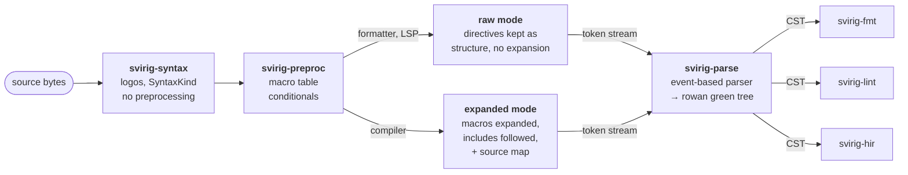

# Project plan

> **Status:** exploratory, with the lexer, the preprocessor and the parser
> done, and the formatter next. Nothing here is a commitment; it is a record
> of what was decided and *why*, so that picking the project up after a
> three-month gap costs an afternoon instead of a week.

The project is `svirig`; see [Naming](#2-naming). Every crate carries that
prefix.

---

## 1. What this is

A suite of SystemVerilog language tooling in Rust, built around one lossless
syntax tree. The first product is a formatter, because that is the smallest
thing that is both genuinely useful and forces the hard parts (a real lexer, a
real preprocessor story, a real grammar) to be solved properly.

The motivation is that SystemVerilog developer experience is poor and the
existing options are unsatisfying: `verible-verilog-format` produces output I
don't like, `slang` is excellent but C++ and not aimed at formatting, and the
Rust attempts (`sv-parser`, `moore`, `svls`) are either slow, abandoned, or
not lossless.

### Objectives, in priority order

1. **A SystemVerilog formatter I actually want to use.** Correct on real
   `` `ifdef ``-heavy, UVM-macro-heavy code, not just on textbook RTL.
2. **A reusable lossless syntax layer** that other tools can be built on —
   linter, LSP, refactoring, doc extraction.
3. **A standalone, correct, fast preprocessor crate.** Independently valuable
   and independently shippable; the Rust ecosystem has nothing good here.
4. *(Speculative, years out)* Semantic analysis — name resolution,
   elaboration, type checking.

### Non-goals

- Simulation, synthesis, or netlist anything.
- Beating `slang` at compilation. `slang` is 200k+ lines and excellent; the
  point is not to replace it.
- Full IEEE 1800-2023 grammar coverage as a precondition for shipping
  anything. See the [verbatim fallback](#the-verbatim-fallback) decision.
- Supporting Verilog-95/2001-only flows as a distinct mode. SystemVerilog
  subsumes them; legacy quirks get handled or they don't.

### Relationship to `slang`

`slang` is the reference implementation and the right thing to consult when a
design question has a non-obvious answer. It is **not** to be transliterated.
In particular: do not copy its type names (`SourceManager`, `Trivia`,
`ParserBase`, …). Pick names that fit Rust and fit this codebase. Understanding
*why* it made a choice is the useful part; the naming is not.

Worth knowing: `slang` is `clang` with an S, and its `SourceManager` /
`Diagnostics` naming comes from there — but its *tree* design (green/red nodes,
trivia attached to tokens) is Roslyn's. `rowan` is that same Roslyn design
ported to Rust via rust-analyzer. So the core data model is already shared;
that convergence is inheritance from a common ancestor, not imitation.

---

## 2. Naming

**`svirig`** — `sv` plus Swiss German *schwirig*, "difficult". Free on
crates.io and on GitHub as of 2026-08-17.

- **Every crate is prefixed `svirig-`** — `svirig-text`, `svirig-syntax`,
  `svirig-preproc`, `svirig-parse`, `svirig-fmt`. Unprefixed `sv-*` names were
  considered and rejected: the prefix makes provenance obvious and puts the
  whole namespace out of reach of a future collision. (`sv-parser` is already
  taken by dalance, which is the argument in miniature.)
- The driver binary is `svirig`.
- `svfmt` is **taken on crates.io** by an existing SystemVerilog formatter.
  Don't plan on it as a package name.

Also considered and free, should this ever need reopening: `sven`, `cant`
(thieves' *cant*, the direct riff on `slang`), `svengali`, `verilust`,
`metastable`. Most of the Rust/iron-chemistry space (`ferrite`, `patina`,
`oxide`, `ferrous`, `hematite`, `magnetite`, `anneal`, `slag`) is taken.

---

## 3. Architecture

### Data flow

The parser is **parameterised over its token source** and does not know which
mode it is in. That is what lets one grammar serve both the formatter and any
future compiler.

### Crates

| Crate | Contents | Status |
| --- | --- | --- |
| `svirig-text` | File ids, spans, the origin map for expanded tokens, the file store, reading a file | exists |
| `svirig-syntax` | `SyntaxKind`, the `logos` lexer, the keyword table, the `rowan` `Language` impl | exists |
| `svirig-preproc` | Macro table, expansion, `` `include `` resolution, conditional evaluation. Two output modes. | exists |
| `svirig-parse` | Event-based parser, the tree builder, generated AST accessors | exists |
| `svirig-diag` | Rendering a diagnostic: snippets, colour, the include and expansion chains | with the first thing that reports one |
| `svirig-fmt` | Formatting IR, layout rules, alignment pass | M4 |
| `svirig-hir` | Name resolution, elaboration, types | someday / never |
| `svirig` | Driver binary: CLI, file discovery, filelist/`bender` integration | spiked ahead of M4 |

The first four exist and nothing depends on this, so any of them may be
broken, renamed or merged. `svirig-text` and `svirig-syntax` are **siblings,
not a stack**: a `Token` carries bare offsets into whatever text it was lexed
from and never a `Span`, so the vocabulary crate names the store nowhere.

This table is what each crate *holds*. What each one **exposes**, and why —
the two tiers a caller picks between, and where an include path and a
`+define+` arrive — is [`api.md`](api.md).

**`svirig-fmt` still comes out of `svirig-parse` on day one**, because
everything downstream shares the tree and formatting concerns must not leak
into its shape.

### Which parts the driver owns

One subcommand per stage, each printing what that stage produced: `lex`,
`preprocess`, `parse`, and `fmt` when there is a formatter. Every one of them
was an example with its own hand-rolled argument loop first, which is what the
driver replaced.

What stays an example is anything that sweeps the corpus — `metrics`,
`verbatim-report`, `conditionals`. **The dividing line is the file**: a
per-file dump is something a user of the tool runs, and a question about a
corpus is a research instrument that only this repository runs.

Three things are the driver's and belong nowhere else. **Rendering**, for the
same reason `svirig-text` holds a diagnostic and not its rendering: how wide a
column is, or where a comment is cut short, is an opinion about a terminal.
**Filelists**, because `.f` syntax has nothing to do with SystemVerilog and
keeping it out of `svirig-preproc` is the same line that crate already holds
about grammar — see [`api.md`](api.md#where-a-build-comes-from). And **what a
build passes**, which reaches expanded mode today and raw mode when raw mode
can be handed a seeded table.

A filelist arrives through `-f` or `-F`, which differ only in what a relative
path inside one is relative to: the working directory, or the filelist. Both
answers are in circulation and they disagree, so the flag is where it is
settled rather than a rule to remember. What one carries is source paths,
`+incdir+`, `+define+` and another filelist; what it does not carry is
rejected by name, and [`limitations.md`](limitations.md) says why.

That makes every command a many-file command, since a filelist is a list.
Files are read in turn, a heading separates them, one that fails does not stop
the rest, and the exit code says how many did. The heading is a comment for
the one output meant to be read by something other than a person, so that
`preprocess` over a filelist is still a SystemVerilog file.

`-I` and `-D` stay on `preprocess` alone, because raw mode cannot use them; a
filelist carries them to every command all the same, and the commands that
cannot use them say so on stderr rather than ignoring them quietly.

The argument parser is `usage` rather than `clap` ([D14](#4-decisions)), and is
confined to one module so that the commands themselves are ordinary functions
over ordinary types.

### Which way the split runs

The obvious split is to lift the lexer out, and it is the wrong one. See
[D12](#4-decisions).

`SyntaxKind` is a single enum over trivia, tokens, keywords **and** nodes,
with `is_node` a range check against `FIRST_NODE`. A lexer crate would have
to carry the node kinds with it — a vocabulary crate with a 182-line lexer
stapled on — and the alternative, two enums with a conversion, pays at every
token push and leaves 900 lines to keep in sync across a boundary.

Both answer the wrong question. `logos` derives on that enum,
`keyword::lookup` maps into it, and `tree.rs` implements `rowan`'s `Language`
over it — those four files are one thing, and that thing is `svirig-syntax`.
What leaves is everything that *reads* the vocabulary: the preprocessor,
then the parser.

### Diagnostics

The data and the rendering are different crates, split by what they drag in.
`svirig-text` holds `Span`, `Origins`, `trace`, `reported_at` and eventually
a plain `Diagnostic` — every crate that *produces* an error needs that type,
so it sits at the bottom and stays dependency-free. Rendering wants colour,
unicode width and snippet framing for a terminal, and none of that for an
LSP; putting either in `svirig-text` would make the lexer depend on a
terminal renderer to report an unterminated comment.

### Parallelism

None is built. The boundaries above are drawn so that it stays available,
and two of the constraints were cheap to honour early. See
[D13](#4-decisions).

**A file at a time is the only granularity worth having.** The largest file
in the corpus lexes in under 5 ms and builds its tree in 15, so there is
nothing inside one file to split.

**The formatter shares nothing, by construction.** [D6](#4-decisions) has it
never follow an `` `include ``, so each file is formatted alone — and the
types say so: `Raw::new` takes an `Input` and no store, while `Expanded::new`
is the constructor that needs `Origins`.

**Expanded mode serialises on the compilation unit.** Macro definitions hold
to the end of the *compilation unit* (22.3), so several files in one cannot
be parsed independently. Each file its own unit, and the dependency is gone.
That is a scheduling constraint, not a lock — `slang` expresses it the same
way, parsing separate units through a thread pool while the single-unit path
stays sequential and macro-inheriting libraries wait for it.

**What is worth sharing is the bytes, not the buffers.** Two `` `include ``s
of one header are deliberately two buffers with different `included_from`, so
a shared store buys no deduplication. What deduplicates is the bytes behind a
path, which makes a caching `Reader` the one genuinely shared structure — and
the reason `Reader` is `Sync`. `Origins` stays per thread, which also
sidesteps `Origins::text` returning a `&str` that cannot leave a lock guard.

**Three constraints already honoured.** `SyntaxNode` is `!Send` and
`GreenNode` is `Send + Sync`, so a worker returns green and whoever consumes
it roots the tree on its own thread. `Reader: Sync` is a supertrait, so a
reader that caches hears about its `RefCell` at the `impl`. And `Session`'s
lex cache holds `Rc`, which makes one `!Send` — fine, because each worker
should build its own, but it is a choice rather than an accident.

### The whitespace model

Four parts. The first is built — it is what the tree builder does with trivia —
and the other three are where M4 starts:

- **Trivia is placed, never skipped.** Leading trivia belongs to the item that
  follows; a same-line trailing comment stays with the token it annotates.
- **Separation is requested, not written.** No rule writes a space or newline;
  it requests a minimum separation, resolved lazily when the next thing is
  written. Gives no-trailing-whitespace and call-site-free indentation for
  free.
- **Whitespace is discarded, its signal is not.** Blank lines are lifted out as
  a gap *width*, not as a separation in their own right.
- **Verify by re-lexing.** The output's token stream must equal the input's.

### Where that model is not enough

- **Event-based parser, not direct `GreenNodeBuilder` calls.** Driving the
  builder inline with `Checkpoint` works for a language that is nearly
  LL(1). SystemVerilog is not — see [decision D2](#4-decisions) — and checkpoints
  allow retroactive *wrapping* but not *undo*. Emit a flat `Vec<Event>` and
  build the green tree at the end; snapshot is `(events.len(), token_pos)` and
  rollback is a truncate. **Retrofitting this later is a parser rewrite.**
- **Directives cannot all be opaque single-line trivia.** See
  [`preprocessor.md`](preprocessor.md).
- **Alignment is a first-class requirement**, and the gap model above cannot
  express it. Needs a post-pass. See [decision D4](#4-decisions).

---

## 4. Decisions

| # | Decision | Rationale |
| --- | --- | --- |
| D1 | `logos` for lexing, `rowan` for the tree | `rowan` is the Roslyn model, which is the right model for lossless trees. Lexer **modes** (`Lexer::morph`) were expected for macro body text, UDP `table`/`endtable`, directive arguments and `` `pragma protect `` envelopes. Bodies then turned out to need one differing rule and their extent, not a second token enum — so budget for modes, but make each one earn itself. See [`limitations.md`](limitations.md). |
| D2 | Hand-written recursive descent, **event-based**, with speculative parse + rollback | SV is not LL(k). The killer is type/expression ambiguity: `foo bar;` is a declaration only if `foo` names a type; `(a)(b)` is a cast or a call. `slang` resolves it by scanning ahead over tokens it has not consumed and then committing irrevocably — it has no rollback at all, because a guess that turns out wrong becomes a diagnostic. A formatter has no such exit: a wrong guess has to give the bytes back ([D3](#the-verbatim-fallback)), and giving them back is undo. No generated-parser framework handles this cleanly. |
| D3 | **Verbatim fallback node from day one** | See below. Highest-leverage single decision in this document. |
| D4 | Column alignment is a separate post-pass over emitted lines | SV culture expects aligned `.port_i (sig)` connections and `assign` RHS (lowRISC, PULP styles mandate it). This fits neither a Wadler IR nor the gap model. Align within maximal runs of same-shaped siblings, broken by blank lines and comments. |
| D5 | Formatter is **preprocessor-transparent**, enforced as an assertion | See [`preprocessor.md`](preprocessor.md#the-transparency-invariant). |
| D6 | Formatter never follows `` `include `` | Each file is formatted independently. A compiler must follow includes; a formatter must not. |
| D7 | Few knobs: indent width, line width, alignment on/off | Resist a style-option matrix. `gofmt`-style opinionation is cheaper to maintain and the thing people actually want. Default line width 100. |
| D8 | Dual MIT / Apache-2.0 | Rust ecosystem norm. |
| D9 | **Provenance is recorded per token, not per byte** | See below. |
| D10 | **The line table is built eagerly**, when a buffer is added | One cache-hot, vectorisable pass and 4 bytes per line, against a lexing pass that costs far more. Lazy would want a `OnceLock`, and the query pattern that settles the design — a diagnostics layer, or an editor — does not exist yet. |
| D11 | **Node kinds are hand-authored, not generated from Annex A** | The standard's productions are a presentation of the language, not a tree shape. See below. |
| D12 | **The crate split runs from the parser end, not the lexer end** | `SyntaxKind` covers tokens and nodes in one enum, and `logos` derives on it. A lexer crate would have to carry the node kinds; what can leave is whatever reads the vocabulary. See [Which way the split runs](#which-way-the-split-runs). |
| D13 | **Parallelism is one file at a time** | Nothing finer pays: the largest corpus file lexes in under 5 ms. The formatter shares nothing because [D6](#4-decisions) already removed the cross-file dependency; expanded mode serialises on the compilation unit (22.3). See [Parallelism](#parallelism). |
| D14 | **`usage` for the command line, not `clap`** | The driver is a spike and the argument parser is the cheapest part of it to replace, so it is the place to try something. What `usage` adds over `clap` is that the same declarations produce the shell completions and the reference documentation, which is the half of a CLI that otherwise rots. Cost is an MSRV of 1.91 and a crate at version 6 with little history. Contained by keeping every derive in one module and every command a plain function: see [Which parts the driver owns](#which-parts-the-driver-owns). |

### Per-token provenance

The state of the art tracks source locations as a byte offset into a flat
space, where each file — and each macro expansion — owns a contiguous chunk of
it. A location is one integer and the manager decodes it. `slang` does this,
inheriting it from `clang`; `rustc` does the same.

It is the right model for a preprocessor that re-emits *text*, and it has one
awkward consequence. Expanding `` `define M(x) f(x) `` at `` `M(a+b) ``
produces tokens with two different homes: `f` is written in the body, `a` is
written in the argument at the call site. A byte-oriented map cannot say that
directly, because the expansion is one chunk with one spelling. `slang`
resolves it by *swapping the roles* of "written here" and "expanded there" for
argument tokens, and carries a flag saying which way round a given chunk is.

We emit tokens, not text, so we can record the spelling on each token and skip
the whole problem: the two tokens simply carry different spans and the same
expansion. Cost is a few bytes per token on the expanded path only; the raw
path keeps the plain `Token` it already has.

**This is only available because the expanded output is a token stream.** If
that ever changes — a `-E` mode that prints preprocessed text is the obvious
candidate — that mode gets its own path rather than dragging the map back to
bytes.

### The verbatim fallback

Annex A of IEEE 1800-2023 is 747 productions. Full coverage is a
multi-year slog. **If an unrecognised construct degrades to "leave this
region's bytes alone" instead of failing the file, a genuinely useful formatter
can ship at 40% grammar coverage.** Every existing tool fails hard on
constructs it doesn't know; that is the gap worth exploiting.

Concretely: a `VERBATIM` node kind that holds a balanced, byte-exact token
span, produced whenever the parser cannot make progress at an item, member, or
statement boundary. The formatter emits it untouched and resyncs after it.

### Node kinds are not Annex A's productions

The tempting move is to transcribe Annex A and generate the node half of
`SyntaxKind` from it: one source of truth, and
[`grammar-coverage.md`](grammar-coverage.md) generated for free. It is the
wrong move, and the reason is worth writing down because it will look tempting
again.

**Annex A names productions to explain the language, not to shape a tree.**
Of its 747 productions, 122 are pure aliases whose right-hand side is a single
nonterminal — `limit_value ::= constant_mintypmax_expression`,
`covergroup_expression ::= expression` — and another 80 are `*_identifier`
productions that are all one `IDENT` token and differ only in what the name
will later turn out to mean. Building a node for any of those puts a wrapper in
the tree that carries no information and that every traversal then has to step
through; not building it leaves a variant nothing constructs.

The expression grammar does not survive the trip at all. `expression ::=
primary | expression binary_operator { attribute_instance } expression | …` is
written for a reader, and a precedence-climbing parser produces `BIN_EXPR`,
`UNARY_EXPR`, `PAREN_EXPR`, `TERNARY_EXPR` — none of which are Annex A names,
while `expression` and `binary_operator` never become nodes. The whole
`constant_expression` / `constant_primary` / `covergroup_expression` layer
encodes *where* an expression may appear, which a recursive-descent parser says
by which function it calls.

So generating the enum changes no parser code and no tree — the functions pass
the same kinds to `complete` either way — and leaves roughly 660 variants that
nothing constructs. What that costs is the exhaustiveness check in the
formatter, which is the compiler saying "you added a node kind and gave it no
layout rule". That signal is worth having at 80 kinds and is gone at 747,
because the match needs a catch-all arm to compile.

**The grammar is still worth extracting, to read.** Grepping
`data_declaration ::=` beats paging through a PDF, and the list of production
names is an honest checklist for coverage. Neither use requires it to define
the enum. What lands in git is the name list and an implemented flag, which is
fact rather than expression; the grammar itself is gitignored like the corpus,
and the script that produces it takes the PDF path as an argument, because a
committed script may not name a path under `reference/`.

---

## 5. Milestones

Each rung is independently completable and independently valuable. Resist
starting the next before the current one is *done*, because the temptation to
skip ahead to the formatter is what kills projects like this.

**M0 — Scaffolding.** *Done.* Workspace, git hooks (`cargo fmt`, `actionlint`
and `typos` at commit; `clippy` and `cargo doc` at push),
`scripts/fetch-corpus.sh`, these documents.

The split is about what each check needs. Formatting and spelling hold for a
commit that does not compile, and a checkpoint mid-thought is a reasonable
thing to record; `clippy` and `cargo doc` demand a workspace that builds, so
they run before the work leaves the machine rather than before it is written
down. Both cost about half a second on this codebase, which is why neither is
worth deferring further.

There is **deliberately no CI**, because Actions minutes are billed on private
repositories and free on public ones. What it would add over the hooks is
`test`, which wants the corpus and is far too slow to hang off a push; add it
on the day this goes public, or sooner if something ever regresses past the
hooks.

**M1 — Lexer complete.** *Done.* Token inventory, keyword table, and a gapless
token stream; round-trip holds over the whole corpus with zero unlexable spans.

The gate was originally "byte-exact round-trip over the corpus", and that
turned out to be **too weak to be worth much**: it was met by the raw `logos`
rules before a `Lexer` type existed, because it proves only that every byte
lands in exactly one token, never that the token was labelled correctly. A
miss-kinded token passes it.

The gate is therefore round-trip *plus* the kind audits in
`crates/svirig-syntax/tests/lexer.rs` — realistic snippets with their full kind
sequences written out, covering the places a wrong label is plausible. That is
weaker than a differential test against another implementation's lexer, which
was considered and deferred; see [`limitations.md`](limitations.md). The
parser is the real oracle and it arrives at M3.

Lexer modes were the one piece left, and they are deferred rather than
outstanding. `` `define `` bodies are handled, as the first piece of M2. UDP
tables and `` `pragma protect `` envelopes occur zero and one times in the
corpus and are not. See [`limitations.md`](limitations.md).

**M2 — Preprocessor complete.** *Done.* Expansion, `` `include ``,
conditionals, both output modes, origin map. It is `svirig-preproc` now, and
depends on no grammar.

A workable order, cheapest and most-constrained first: `` `define `` body
lexing (the one lexer mode that is not speculative) → directive parsing with
`\` continuations → the macro table and expansion → `` `include `` resolution
→ conditional evaluation → the origin map. Only the last has a hard
constraint: **the origin map has to exist before the expanded mode has any
users**, because every diagnostic on the compiler path needs it and
retrofitting it means touching everything that already consumes tokens.

That order held except for the origin map, which moved to the front —
deliberately, because its constraint reaches back into expansion itself:
expansion is what *produces* the expanded stream, so it had to decide first
what an expanded token is.

**The gate is met.** `slang -E --comments` over the whole corpus, token
sequences compared: 1843 files agree outright and 153 agree except where the
reference is wrong, both of those defects confirmed against a third
preprocessor. Nothing is filtered out; the 3630 the reference declines are the
ones it wants an include path or a `+define+` for, and reaching those means
handing *both* sides what a build passes — which is the driver's job, at M4.

Widening the comparison is what found the last two real bugs, both in code that
had passed every targeted test. That is the argument for an oracle over a test
suite, and for [running it against everything](preprocessor.md#the-oracle)
rather than against what is convenient.

**M3 — Parser skeleton + RTL subset.** *Closed.* Event infrastructure,
rollback, the `VERBATIM` fallback, the preprocessor's own structure in the
tree — macro calls, directives, conditional regions — expressions,
declarations, and the constructs that hold them: module/interface/package/class
shells, `always` blocks, statements and `generate`. Plus the second half of
Level C: a conditional region whose branches all balance has each branch
parsed in the enclosing context.

The type-versus-expression ambiguity [D2](#4-decisions) names is answered, as
far as a formatter can answer it, entirely by questions about *shape*: two
names in a row are a declaration because nothing else in the language is
written that way, and the `(` that would follow the second one is what makes
it an instantiation instead. A set of the names a file typedefs for itself
also answered it, less well, and is gone. See
[`limitations.md`](limitations.md#a-type-is-decided-by-shape-and-never-resolved).

`SyntaxKind` is **not** generated from a transcribed Annex A, which this
originally called for; [D11](#node-kinds-are-not-annex-as-productions) is why,
and the transcription still happened, to read.

**Gate: parses the corpus with a measured, decreasing verbatim-fallback rate.**
Met, at **5.18% of 6,184,959 deduplicated tokens**, down from 100.0%, and
**4.03%** since. Nearly three quarters of what is left is [six constructs left
to the fallback on purpose](limitations.md), so the number that matters for M4
is smaller than it looks. The per-repo table, the commits it was measured at, and what the corpus
tests assert are in
[`grammar-coverage.md`](grammar-coverage.md#metrics-at-the-close-of-m3).

The fuzzer arrived with the gate rather than after it. `tests/fuzz.rs` holds
random bytes, random sequences of real tokens, and splices of corpus files to
the two properties that hold for all input: **the tree's text is the input, and
nothing panics.** Everything else the parser does is a judgement about what the
text means, and a judgement can be wrong without the tool being broken — which
is what the fallback is for.

**M4 — Formatter v0.** Declarations, port lists, `always` blocks, expressions.
**Gate: idempotency + preprocessor-transparency assertions hold over the whole
corpus; `slang --parse-only` succeeds identically before and after.** First
release. *Months.*

**M5 — Alignment pass, config, real-world polish.**

**M6 — Open question:** LSP, linter, or semantic analysis. Decide with data
about what is actually missing, not now.

---

## 6. Corpus and testing

Fetched by `scripts/fetch-corpus.sh` into a gitignored `corpus/`, never
vendored. Start small — three repos is enough to keep the lexer honest, and a
corpus that takes ten minutes to fetch is one that stops being run:

| Repo | Why |
| --- | --- |
| `pulp-platform/common_cells` | Small, the house style this tool has to be good at |
| `openhwgroup/cva6` | Real, substantial RTL |
| `lowRISC/ibex` | Real, well-written, different house style |
| `lowRISC/opentitan` | Added to answer the Level C question: large, and heavy on `` `ifdef `` across FPGA/ASIC/DV variants |
| `pulp-platform/axi` | The macro-dense end of the house style — a dozen invocations per file, and conditionals gating four simulators |
| `pulp-platform/cheshire` | SoC integration level, where FPGA-versus-ASIC conditionals live |
| `pulp-platform/FlooNoC` | Modern and generate-heavy |
| `pulp-platform/iDMA` | Template-generated RTL |
| `pulp-platform/snitch_cluster` | Large, and a different subsystem style |

Add repos when there is a question they would answer, not before:
`accellera/uvm-core` once macro invocations are handled (**the** macro torture
test — if UVM parses, the model works), `black-parrot` and `chipsalliance/*`
for breadth after that.

Note that the repos overlap: `cva6` vendors `common_cells`, and both `cva6`
and `ibex` vendor `lowrisc_ip` and `google_riscv-dv`. Any number pooled across
the corpus has to deduplicate by file content or it double-counts — 1149 of
5305 files are copies.

`scripts/fetch-corpus.sh` writes `corpus/MANIFEST` with the resolved commit of
each repo. `corpus/` is gitignored and the file is overwritten by the next
fetch, so **a number quoted in these documents must write its own commits out
beside it**; pointing at `MANIFEST` traces to whatever happens to be on disk.

Three oracles, all cheap, and between them they catch nearly everything:

1. **Round-trip / token-stream equality** — output re-lexes to the input's
   token stream modulo whitespace.
2. **Idempotency** — `format(format(x)) == format(x)`.
3. **`slang` differential** — `slang --parse-only` succeeds on input and
   output identically; `slang -E` agrees with `svirig-preproc`.

Plus snapshot tests for formatting decisions, and a fuzzer, which landed with
M3: see [`grammar-coverage.md`](grammar-coverage.md#the-fuzzer).

**A test that reads the corpus is named `corpus_*`.** Five of them exist and
they are most of the cost of the suite. The name is what lets them be left out --
`cargo nextest run -P quick --workspace`, or `cargo test --workspace -- --skip
corpus_` without nextest -- so the tight loop stays instant while a plain
`cargo nextest run --workspace` still runs everything. Excluding them by
*default* was considered and rejected: a green run that quietly skipped the
corpus is worse than a slow one.

**`--workspace` is not optional in any of those.** The workspace names the
driver as its [`default-members`](../Cargo.toml) so that `cargo run` needs no
`-p`, and that narrows every command which takes a package: without it those
same lines run 27 tests instead of 315, and say nothing about the difference.
The hooks pass it already.

---

## 7. How to resume this project

If you're reading this after a long gap:

1. Read this file, then [`preprocessor.md`](preprocessor.md), and
   [`api.md`](api.md) if you are about to change what a crate exposes.
2. If [`next.md`](next.md) exists, it is the queue for the milestone in
   progress, and says where the last session stopped.
3. `git log --oneline docs/` — the *history* of these documents is usually more
   informative than their current state, because it shows what was reconsidered.
4. Check [`grammar-coverage.md`](grammar-coverage.md) for where the parser
   actually stands, and [`limitations.md`](limitations.md) for what was
   deliberately left undone and why.
5. `cargo doc --open --workspace` — every module carries a doc comment saying
   what it holds and, more usefully, what shape was rejected and why. That is
   the map, and it is next to the code rather than in a file that can drift
   away from it.

---

## 8. Open questions

- ~~Does the "self-delimiting branch" classification cover the common cases?~~
  **Answered: yes, 96.4% of 1366 regions**, and the figure is exact rather than
  a lower bound — re-measured with the macros expanded, not one region reads
  differently. See [`preprocessor.md`](preprocessor.md#measured). One caveat
  stands: the corpus is all well-kept code, so the number says clean
  SystemVerilog is clean, not that hostile SystemVerilog is rare. The parser's
  own classification, written separately and used rather than merely reported,
  [agrees to the decimal](grammar-coverage.md#metrics-at-the-close-of-m3).
- ~~Is `rowan` the right tree for a file the size of a preprocessed UVM
  testbench?~~ **Answered for the token layer: yes, with room to spare.** The
  largest file in the corpus — `pinmux_reg_top.sv`, 1.3 MB and 298k tokens, in
  `opentitan` at `34ceb5eb56` under `hw/top_darjeeling` — is stored and lexed
  in 4.8 ms and builds its tree in 15.5 ms, 19.3 Mtok/s, at a peak of 29.6 MB
  resident against roughly 5 MB of source and tokens. The first figure was
  2.8 ms when it measured the lex alone; the session lexes a file as it is
  added, so it now covers the line table as well. The whole corpus, 5626 files and 53 MB, round-trips through the tree
  in 1.9 s. Measured with
  `cargo run --release -p svirig -- parse <file> --stats`, which is what the
  `dump-cst` example that first measured it became.

  That figure had a caveat: with no grammar, the tree was one node over 298k
  leaves, so it measured how `rowan` stores *tokens* and said nothing about
  the node layer. **Re-measured at the close of M3, with a real tree shape:**
  the same file is 131,890 nodes over 298,173 leaves, parses in 19.7 ms
  (15.1 Mtok/s) at 32.7 MB resident. So the whole node layer costs 4 ms and
  3 MB on the largest file in the corpus, and the answer holds with the room
  to spare it claimed.
- ~~How much of Annex A can be transcribed mechanically from the PDF versus by
  hand?~~ **Answered: nearly all of it, and it does not matter as much as
  expected.** `pdftotext -layout` yields 2621 usable lines and all 747
  productions; the only bulk noise is running headers, and the only real trap
  is footnote superscripts glued onto names (`covergroup_expression31`), which
  cannot be stripped blindly because `delay2`, `strength0` and `bufif1` are
  real names — cross-checking against the set of defined left-hand sides
  settles all but a handful. The question mattered on the assumption that the
  enum would be generated from the result, and [D11](#node-kinds-are-not-annex-as-productions)
  says it is not.
- ~~`bender` integration for filelists/defines/incdirs: at M4 or later?~~
  **Half answered.** Plain `.f` filelists are read, and defines are seeded
  through the synthesised `<command-line>` buffer
  [`api.md`](api.md#what-a-build-passes) calls for — from the driver, through
  the span form of expansion, because `Session` still carries no `Build`. What
  stays open is the manifest: whether `svirig` learns to read a `Bender.yml`
  itself, or whether `bender script flist` writing a `.f` is already the whole
  integration. The second costs nothing and is the one to try first.
